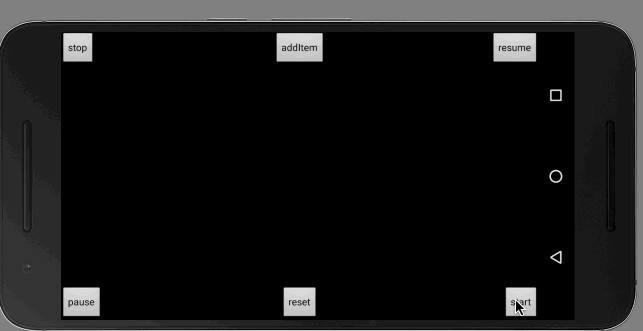

# BarrageView
一个可以自定义弹幕，目前可以加入弹幕背景，弹幕的图片。以及调节弹幕的一些信息
android BarrageView ,Currently only from right to left to achieve the effect of the barrage , the future may join in all directions .

# Renderings
[barrageview example.apk download url](http://fir.im/ywlh)


# how to use
##Gradle
```
compile 'com.youku.rrtoyewx.barragelibrary:barragelibrary:1.0.2'
```
## Maven
```
<dependency>
  <groupId>com.youku.rrtoyewx.barragelibrary</groupId>
  <artifactId>barragelibrary</artifactId>
  <version>1.0.2</version>
  <type>pom</type>
</dependency>
```

## BarrageView
```
<com.youku.rrtoyewx.barragelibrary.BarrageView
        android:id="@+id/barrageview"
        android:layout_width="wrap_content"
        android:layout_height="wrap_content"
        app:auto_adjust_add_count="true"
        app:chanel_add_count="3"
        app:chanel_add_time="1000"
        app:chanel_counts="5"
        app:max_barrage_counts_in_line="20" />
```


1. auto_adjust_add_count: depending on the number barrage did not show dynamically adjust the number of time to take the barrage
2. chanel_counts: barrage chanel counts
3. max_barrage_counts_in_line: max number display in row
4. chanel_add_time: interval of take once
5. chanel_add_count: number of take barrage once

## BaseBarrageItem 
You can use BaseBarrageItem to draw you barrage, you want to set some properties by the constructors,such as color, size, display information, speed, and acceleration

```
items.add(new NormalBarrageItem.BarrageItemBuilder()
                    .textSize(40)
                    .contentStr("即带背景也带图片的message" +i)
                    .bgRsd(R.drawable.bg)
                    .imageRsd(R.drawable.favourite_love_yellow)
                    .color(Color.RED)
                    .speed(2)
                    .paddingSize(20)
                    .interpolator(new AccelerateDecelerateInterpolator())
                    .create(this));

```
